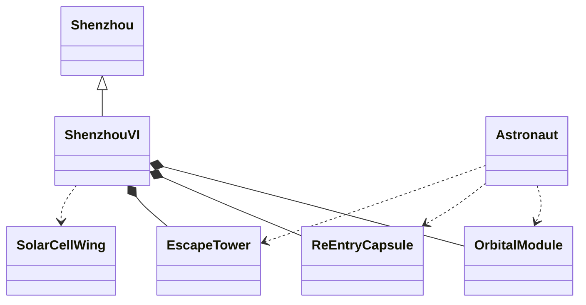

## Original Problem:

> The Shenzhou VI spacecraft is one of the Shenzhou spacecraft series, consisting of orbital module, re-entry capsule and escape tower. The re-entry capsule is where astronauts can drive the spacecraft, while the orbital module is where they work and have a rest. In case of emergency, astronauts can go to the escape tower for safety. The spacecraft is flanked by wings of solar cells that provide electricity.
{: .prompt-info }

Based on the description above, draw a UML class diagram.

## My solution

